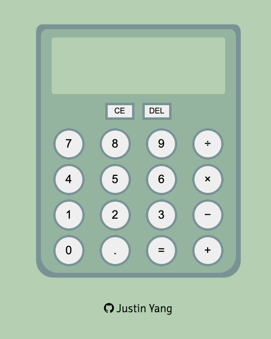

# Calculator

https://jyfoil.github.io/calculator/

## Project Description

This is a calculator project made with HTML, CSS, and JavaScript. The key features of this calculator include:

- Adding, Subtracting, Multiplying, and Dividing multiple numbers
- A Clear button that resets the display
- A Delete button that deletes the last inputted number
- A decimal point button that allows decimal calculations

## Reflection

Writing the logic for the calculator was extremely rewarding yet difficult, as I continued to solve small bugs I ended up creating another bug. This process continued until I fixed all bugs. Going forward I definitely will focus on making my code more readable as I feel my current code is difficult to read.
